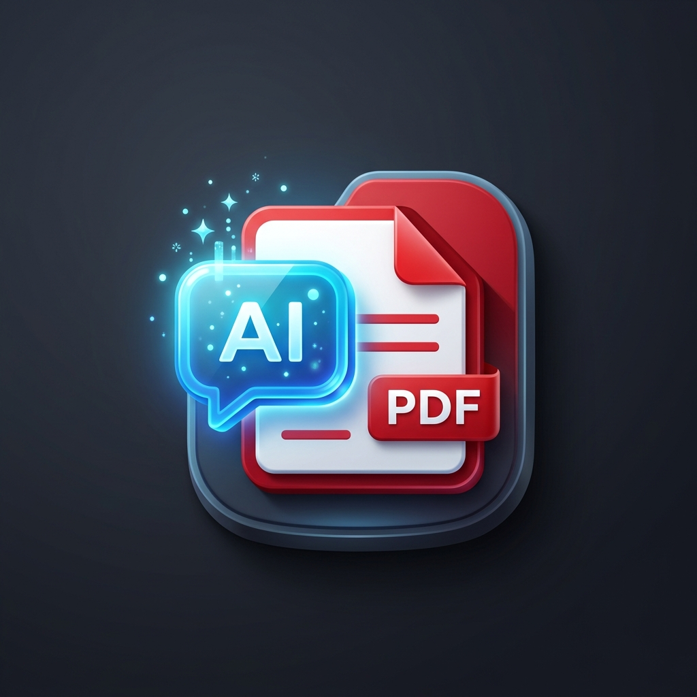
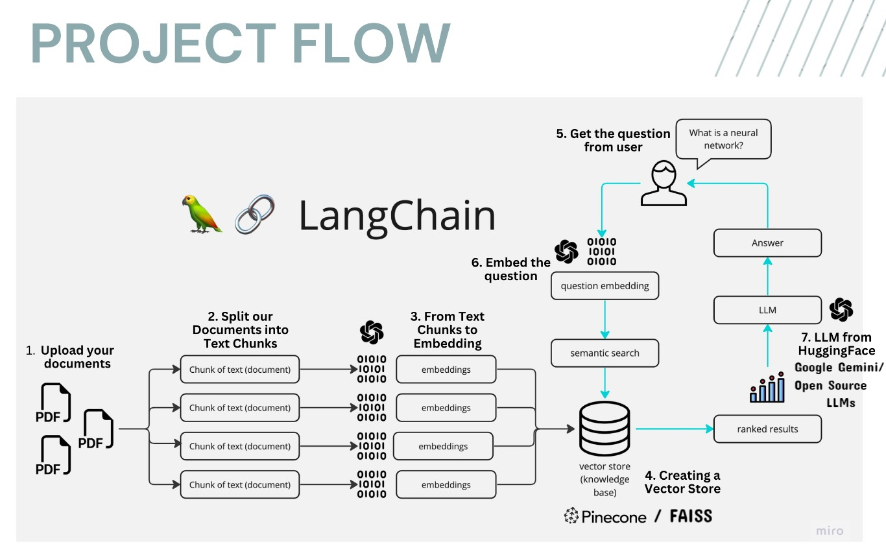

# Multi-PDFs ChatAI 📚🤖

Chat seamlessly with Multiple PDFs using **LangChain**, **Google Gemini 1.5 Flash** & **FAISS Vector DB** — all powered by a beautiful **Streamlit** interface. Get instant, accurate responses grounded entirely in your uploaded documents. 🔥✨

---

## 🖼️ App Logo



---

## 📝 Description
**Multi-PDFs ChatAI** is a Streamlit-based RAG (Retrieval-Augmented Generation) web application. Upload multiple PDF files, process them into a searchable vector index, and chat with an AI that answers questions directly from your document content — with full chat history, Day/Night theme, and source viewing.

---


## 🎯 How It Works



1. **PDF Loading** — PyMuPDF extracts clean, structured text from uploaded PDFs.
2. **Text Chunking** — Text is split into 1000-character chunks with 150-char overlap for precise retrieval.
3. **Embedding** — Google `text-embedding-004` converts each chunk into a semantic vector.
4. **Vector Storage** — FAISS stores and indexes all vectors locally.
5. **Similarity Search** — Your question is embedded and matched against stored chunks.
6. **Answer Generation** — Gemini 1.5 Flash generates an answer grounded in retrieved context.
7. **Chat Memory** — Full conversation history is preserved in the session.

---

## ✨ Key Features

- 📄 **Multi-PDF Upload** — Upload and process multiple PDFs at once
- 💬 **Chat Interface** — Full chat history with message bubbles (like ChatGPT)
- 🧠 **Google Gemini 1.5 Flash** — Fast, accurate AI responses
- 🔍 **Show PDF Sources** — Toggle to see which PDF passages were used
- 📝 **Detailed / Concise Toggle** — Switch between full and summary answers
- ☀️🌙 **Day / Night Mode** — Instant theme switching
- ⚡ **Cached Vector Store** — 5x faster responses via `@st.cache_resource`
- 🗑️ **Clear Chat** — Reset conversation anytime

---

## 🌟 Tech Stack

| Layer | Technology |
|:---|:---|
| **LLM** | Google Gemini 1.5 Flash |
| **Embeddings** | Google text-embedding-004 |
| **Vector DB** | FAISS |
| **PDF Extraction** | PyMuPDF (fitz) |
| **Orchestration** | LangChain (LCEL) |
| **UI** | Streamlit |
| **Environment** | python-dotenv |

---

## ▶️ Installation

**1. Clone the repository:**
```bash
git clone https://github.com/Pygod123/Multi-PDFs_ChatAI.git
cd Multi-PDFs_ChatAI
```

**2. Install dependencies:**
```bash
pip install -r requirements.txt
```

**3. Set up your Google API key — create a `.env` file:**
```
GOOGLE_API_KEY=your_gemini_api_key_here
```
Get your key from: https://aistudio.google.com/app/apikey

**4. Run the app:**
```bash
streamlit run chatapp.py
```

---

## 💡 Usage

1. Enter your Google API Key in the sidebar (if not set in .env)
2. Upload one or more PDF files
3. Click **Submit & Process**
4. Ask questions in the chat input at the bottom
5. Toggle **Show PDF Sources** to see retrieved excerpts
6. Toggle **Detailed Answers** for concise or full responses

---

## ©️ License

Distributed under the MIT License. See `LICENSE` for more information.

---

**Created by Priyanshu** | Made with ❤️
